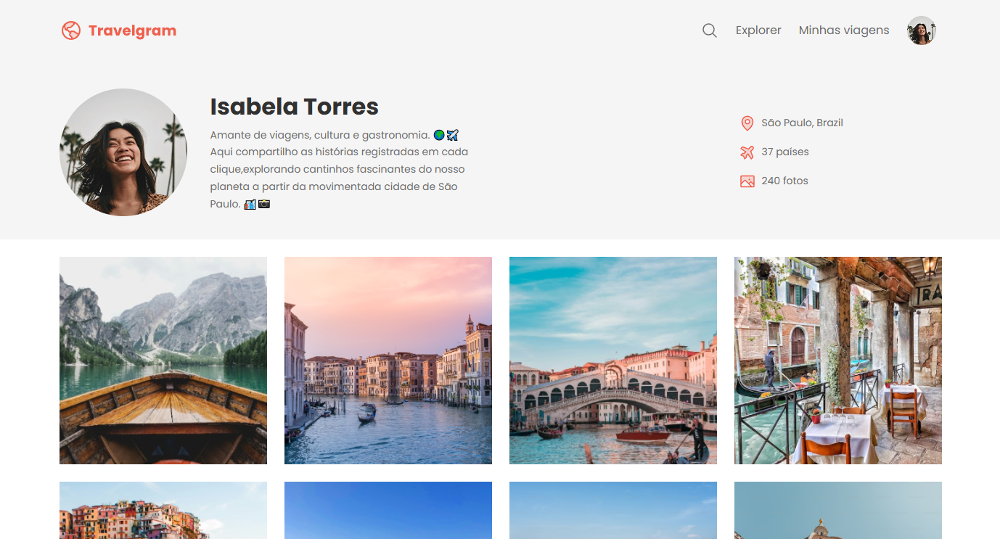

Eu criei um perfil de usuário responsivo para um aplicativo de compartilhamento de viagens. O design inclui uma foto de perfil, uma breve biografia, estatísticas de viagem e uma galeria de imagens. O projeto foi desenvolvido com HTML, CSS e ícones personalizados, focando na estruturação da página, organização do layout e uma interface visual agradável.

